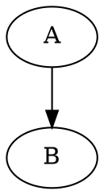

# DiagramAPI

This is backend for **Diagrams Creator** HuggingChat assistant:

https://hf.co/chat/assistant/65e71408a6654bcc68624d8d

## How to run:

Install dependencies:
```bash
sudo apt install graphviz
python -m venv .venv
source .venv/bin/activate
pip install fastapi graphviz uvicorn
```

Run the code:
```
uvicorn main:app --reload
```

## How to use

To use first of all write your DOT code:


URI encode it:
```uri
digraph%20G%20%7B%20A%20-%3E%20B%3B%20%7D
```

And send GET requests:

curl "http://localhost:8000/api?dot=digraph%20G%20%7B%20A%20-%3E%20B%3B%20%7D"


